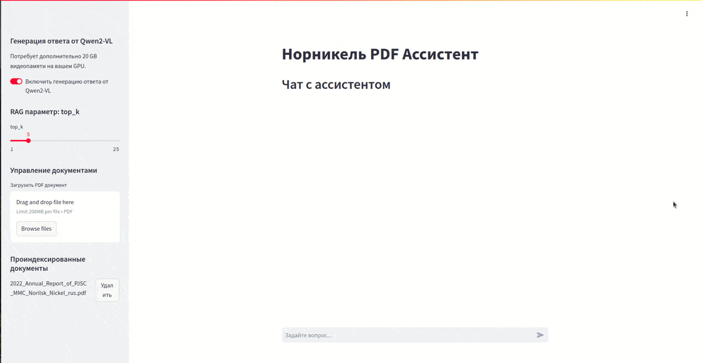
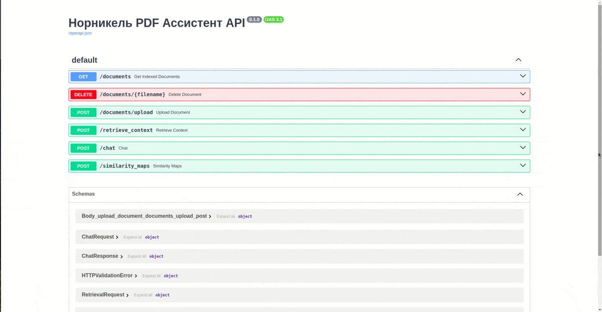

# Норникель PDF Ассистент

Multimodal RAG pipeline with VLM (ColPali) - система для интеллектуального анализа PDF документов с поддержкой мультимодального поиска и генерации ответов.

## Описание

Проект представляет собой систему для работы с PDF документами, которая позволяет:

- Загружать и индексировать PDF документы
- Извлекать текст и изображения из документов
- Осуществлять семантический поиск по содержимому
- Генерировать ответы на вопросы с учетом визуального контекста



## Технологии

- FastAPI
- Streamlit
- ColPali Engine (Qwen2-VL)
- Qdrant Vector Database
- LangChain
- PyTorch
- pdf2image (poppler-utils)

## Требования к системе

- Python 3.10+
- CUDA-совместимая видеокарта (для оптимальной производительности)
- 7.8 GB GPU памяти для RAG
- 25.8 GB GPU памяти для RAG+LLM на Qwen2-VL

## Переменные окружения в .env

Создайте файл `.env` в корневой директории и добавьте необходимые переменные окружения:
```
QDRANT_API_KEY=your_api_key
QDRANT_URL=your_qdrant_url
QDRANT_COLLECTION_NAME=your_collection_name
```

## Установка через Docker:

```bash
docker build -t nornickel-pdf-assistant .
```

## Установка без Docker

2. Установите зависимости с помощью Poetry:

```bash
poetry install
```


## Запуск через Docker

```bash
docker run --gpus all -p 8000:8000 -p 8501:8501 nornickel-pdf-assistant
```

## Запуск без Docker

### Backend API

```bash
uvicorn main:app --host 0.0.0.0 --port 8000
```

### Streamlit Interface

```bash
streamlit run streamlit.py
```

## API Endpoints

- `GET /documents` - Получить список всех проиндексированных документов
- `POST /documents/upload` - Загрузить и проиндексировать PDF документ
- `DELETE /documents/{filename}` - Удалить документ из индекса
- `POST /chat` - Получить ответ от RAG системы
- `POST /retrieve_context` - Получить контекст для ответа
- `POST /similarity_maps` - Получить схожести между документами



## Лицензия

[MIT License](LICENSE.MD)

## Авторы

- Erdeni Tsyrendashiev
- Alexandr Maximov
- Safina Gulyamova
- Nikita Mazein

## Qdrant index

Эмбеддинги изображений хранятся в Qdrant. В **page_content** хранится её base64. В метаданных хранятся **source, page**.

